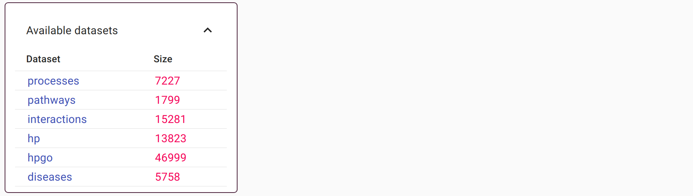
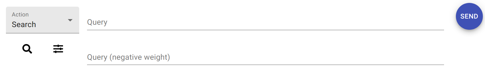
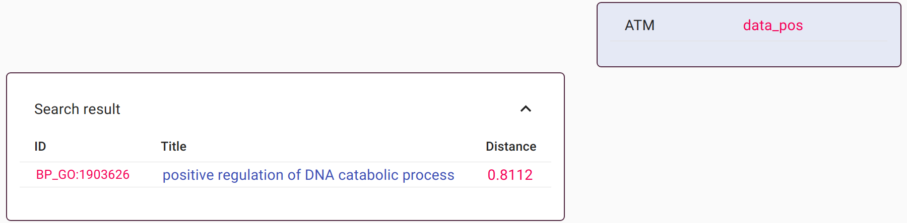
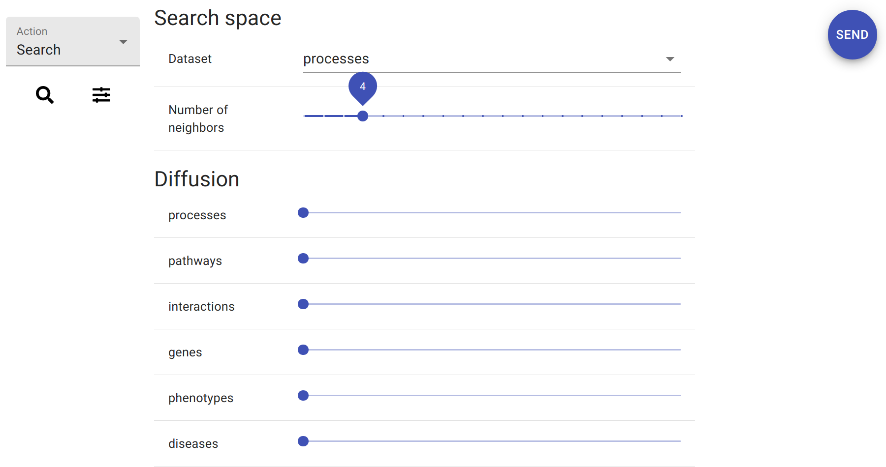
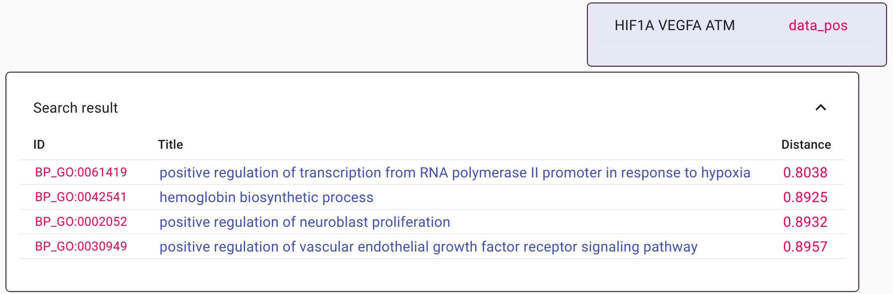
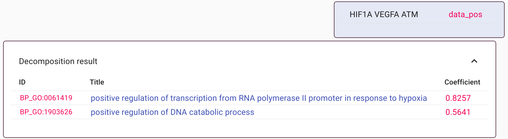
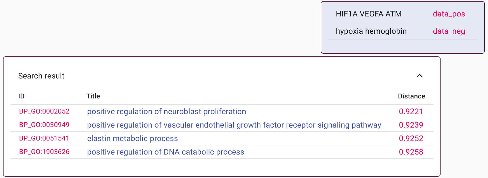
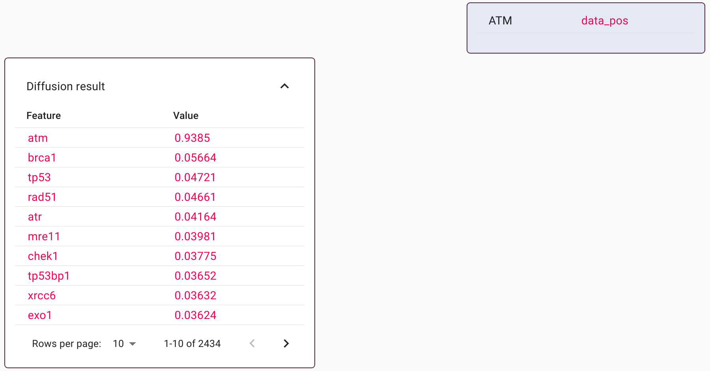
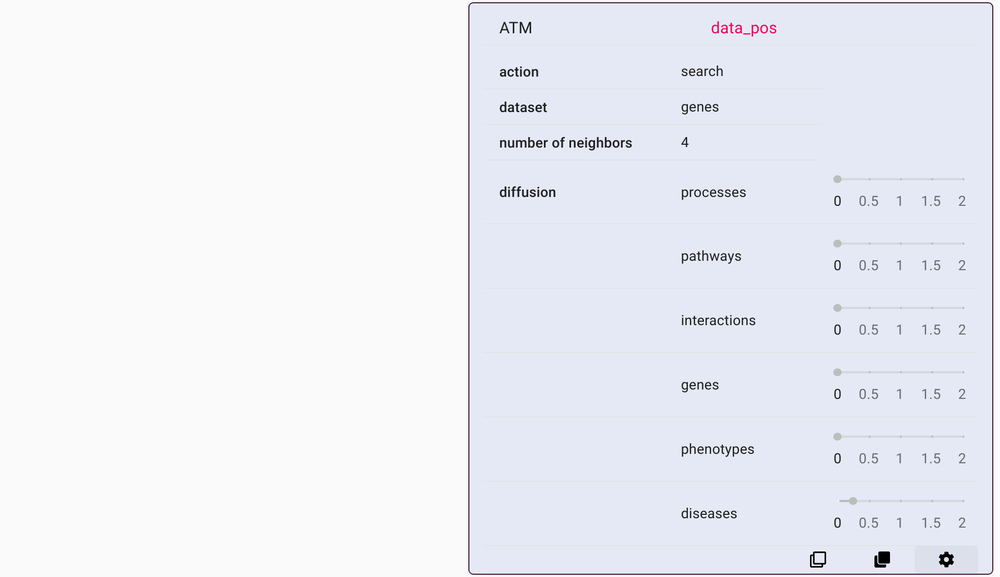

Chat interface
==============

The chat interface is accessible via a web browser. By default, the address
is ``http://0.0.0.0:8099/`` - this indicates the website is running from a
the local computer (not on the internet) on port 8099.

The startup screen shows a summary of the data collections incorporated into
the ``crossmap`` instance. The examples on this page use an instance
that includes collections with gene sets, phenotypes, and disease definitions.

Querying
~~~~~~~~

The interface is organized as a chat. The controller for entering text is at
the bottom.

Entering a query and pressing the SEND button (right-hand-side) triggers a
request to the ``crossmap`` algorithms. The query and the calculation result
appear in the chat history.

In the above example, a query with gene symbol *ATM* was matched with a
GO biological process for DNA catabolism. This is a valid result; clicking
on the reported identifier opens a page that contains the full definition of
that item, which indeed includes the string *ATM*.

Adjusting settings and query types
~~~~~~~~~~~~~~~~~~~~~~~~~~~~~~~~~~

Clicking on the icon with sliders on the left-hand-side of the controller
reveals a form with the available settings regarding the search space and
diffusion.

The drop-down box at the top determines the targeted data collection. This
defaults to the first dataset listed in the startup message.

The next slider determines the number of results shown in the output. The
default value is one. However, in practice it is often of interest to
look at several of the top results. The examples below use a value of four.

Finally, the last group of controls are sliders that determine diffusion
strength. There is one slider for each data collection, as each data collection
can be set to drive diffusion with its own settings. By default, diffusion is
turned off and all the values are at zero.

Clicking on the search icon (magnifying glass) hides the settings and returns
the view to the text areas. Given the adjusted settings, new queries will
produce different output. A search query with several gene names, for example,
will produce four outputs.

Here, the query is a gene set *HIF1A*, *VEGFA*, and *ATM*. The first two
genes participate in oxygen management, and the *ATM* works in distinct pathways
related to DNA and damage repair. In the search results, all the outputs
are driven by *HIF1* and *VEGFA* and describe partially-overlapping biological
processes. This is a natural outcome since those two genes constitute the
majority of the query text.

An alternative means to query is via query decomposition. To activate this,
select 'Decomposition' in the drop-down box on the left-hand-side of the
controller. Processing the same query as before returns a different set of
results.

The decomposition only returns two outputs. The top hit is, as before,
related to oxygen biology and reflects contributions of *HIF1A* and *VEGFA*.
The second hit, however, pertains to DNA and includes *ATM*. Thus, the two
results provide a concise description of the entire query.

Multi-modal queries
~~~~~~~~~~~~~~~~~~~

Multi-modal queries are queries that mix traditional data types. Examples
above used gene sets, i.e. the input strings consisted of gene symbols.
The search boxes treat all inputs as plain text and thus it is possible
to mix gene symbols with any descriptive terms.

The above example includes the same three genes as before. A previous result
showed that the top search results included hits pertaining to hypoxia and
hemoglobin. The new search includes string 'hypoxia' and 'hemoglobin' with
negative weight, and this instructs the search to avoid those features. The
final outcome is a different ranking that de-emphasizes those terms.

Using data diffusion
~~~~~~~~~~~~~~~~~~~~

Data diffusion is a process by which a raw input is augmented with
additional features based on co-occurance of features in existing datasets.
The process thus distributes the information in an input query to new
features, similarly as molecules transfer from one concentrated location to
nearby locations via diffusion.

To activate data imputation, adjust the diffusion sliders in the controller
settings. To preview the effect of the process, adjust the drop-down box on the
left-hand-side of the controller to 'Diffusion'.

The output here is not a database lookup. Instead, the output displays all
the imputed features and their relative weights. In this example, diffusion was
based on protein-protein interactions. The input
string, here *ATM*, retains a dominant weighting, and the remaining features
represent protein interactors. Note, however, that the diffusion can be
driven by any of the datasets (or combinations of datasets) in the ``crossmap``
instance.

Viewing the effect of diffusion is a means to identify the most common
co-occurring features to any given query string. However, diffusion can
also be incorporated into search and decomposition tasks.

Reviewing & Reusing settings
~~~~~~~~~~~~~~~~~~~~~~~~~~~~

All user queries and responses appear in the chat history. Given the many
opportunities for exploratory queries with different settings, a long chat
can end-up containing many similar-looking queries with different reported
rankings. To view how each calculation was performed, hover the mouse near the
bottom of a chat message and click on the cog icon. This will expand the chat
message and reveal the full details of the query.

In this example, the recorded settings that the query string *ATM* was
diffused using the disease collection, and then queried against a collection
containing gene phenotypes. (This is a means to find genes that are similar
from a phenotypic perspective).

Other buttons near the bottom of each chat message copy the query
string or the entire configuration into the controller box at the bottom of
the screen. Thus, each calculation recorded in the chat is reproducible.

