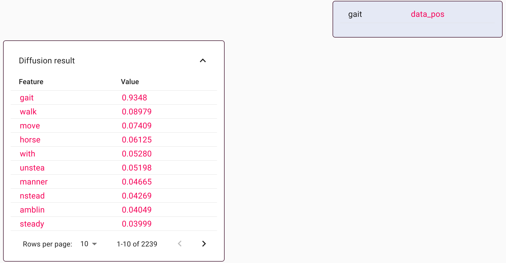
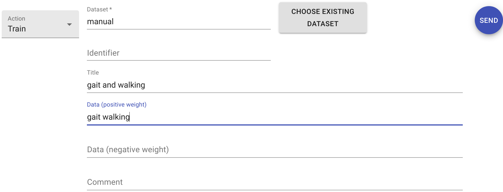
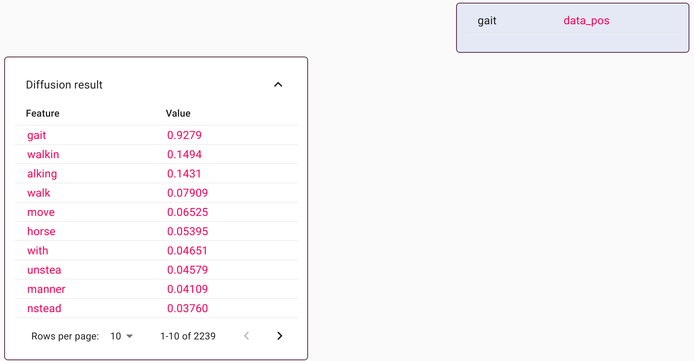

User-driven learning
====================

crossmap instances are not static - they can create and populate new data
collections at run-time. This capability to add data items, together with the
flexibility to use data diffusion, provides a mechanism to train crossmap
instances in real time.

To demonstrate this procedure, consider a crossmap instance that stores a
dictionary of English words (from the `wiktionary <https://www.wiktionary.org/>`_).
Diffusion driven from this dataset reveals features that co-occur in the
dictionary, and thus likely have related meanings.

In the above example, the diffusion of the word 'gait' reveals imputed
values for 'walk', 'move', and many other terms.

Suppose that an important related feature is missing, or weighted
incorrectly. As an example, suppose that 'gait' should strongly diffuse into
'walking'. We can adjust the diffusion profile via user-driven learning.
The graphical interface provides a special form for this purpose. It is
accessible by setting the drop-down box on the left-hand-side of the
controller to 'Train'.

The example above is set to create a new dataset called 'manual' and insert a
new item that consists of the words `gait` and `walking` together. The form
also allows setting a title for the data object and adding a comment (metadata).
Clicking SEND on the completed form instructs crossmap to perform these actions.
A confirmation is displayed within the chat history.

After the new dataset is created, it becomes possible to use that dataset
to drive diffusion.

In this example, the diffusion is driven by the wiktionary and by the manual
dataset. The diffusion profile looks similar to before, but also includes
features from the word 'walking'. The strength of the imputed features can be
adjusted via the diffusion sliders.

When combined with search or with decomposition, the modifed diffusion profile
can result in personalized outputs from those algorithms. This is a mechanism
for users to train the search and decomposition tools in real time.

